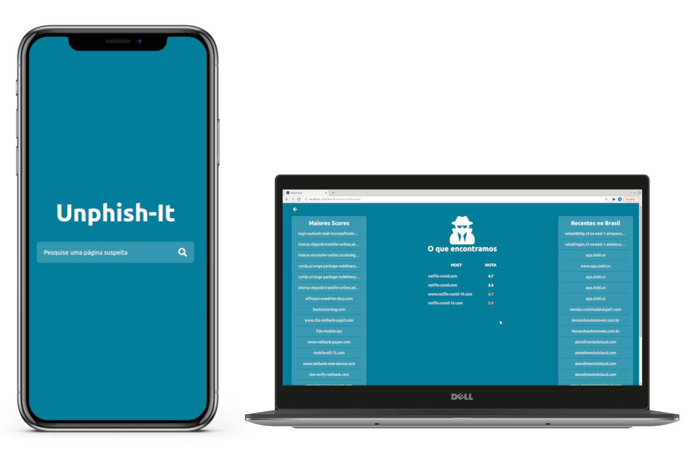

# :fishing_pole_and_fish: Unphish-It :lock:

<p align="center">
  
</p>

## :pushpin: O que é?

Projeto em React que busca por possíveis casos de phishing, a fim de advertir os usuários. Foi criado como objetivo da Oficina de Introdução ao React do SINFORM 2021.

## :rocket: Como executar?

Em seu terminal, primeiro instale as dependências do projeto:

```console
sinform2021@PcDaXuxa-D2043:~$ npm install
```

Após isso, você pode iniciar o projeto a partir do seguinte comando:

```console
sinform2021@PcDaXuxa-D2043:~$ npm start
```